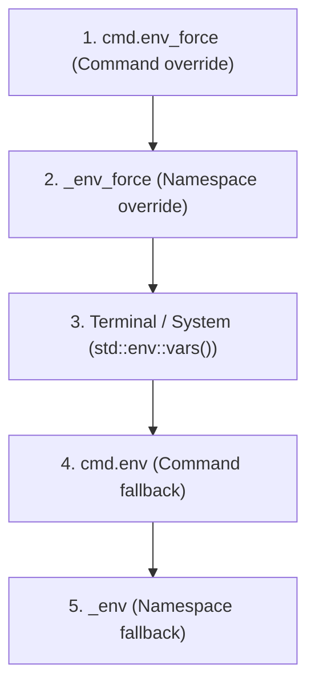

# Environment Variables Guide in Fast-Alias (`fa`)

Fast-alias allows you to manage and supply environment variables directly to your commands and aliases without creating wrapper Bash scripts or cluttering your global shell configuration files (`.zshrc` or `.bashrc`).

---

## 1. Core Concepts: Why Two Modes (`env` vs `env_force`)?

Unlike a standard shell script where `export VAR=...` blindly overwrites existing settings or requires `VAR=${VAR:-default}`, `fa` provides granular control between **default values (fallback)** and **strict overrides (force)**.

| Mode | TOML Keys | Behavior | When to Use |
| :--- | :--- | :--- | :--- |
| **Fallback (Default)** | `env` / `_env` | Applied **only if the variable does NOT already exist** in the calling terminal environment. If the shell already has it set, the shell wins. | Defining sensible defaults (ports, log levels, timeouts) that users can easily override on the fly in their terminal. |
| **Force (Override)** | `env_force` / `_env_force` | **Always wins and overrides** whatever value exists in the system or current terminal session. | Pinning critical paths, AI model weights, specific execution credentials, or mandatory command flags. |

---

## 2. Declaration Scopes

Variables can be declared across an entire command group (**Namespace**) or scoped to a single command (**Individual alias**):

### A. Namespace Level (`_env` and `_env_force`)
Declared with a leading underscore (`_`) directly within the namespace section table (`[aliases.":name"]`). They apply to **all** commands under that namespace:

```toml
[aliases.":skills"]
# Fallback defaults for all :skills commands
_env = { TABERNACULO_CACHE = "memory" }

# Forced overrides for all :skills commands
_env_force = { NODE_ENV = "production" }

list = { command = "tabernaculo list" }
status = { command = "tabernaculo status" }
```

### B. Individual Command Level (`env` and `env_force`)
Declared directly inside the alias entry table:

```toml
[aliases.":ai"]
coder = {
  command = "llama-cli -m $MODEL_PATH",
  env_force = { MODEL_PATH = "/models/coder.gguf" }
}
```

---

## 3. Priority Hierarchy

When invoking an alias (e.g. `fa ai coder`), environment variables are resolved in strict priority order (from highest to lowest):



1. **`cmd.env_force`**: Highest priority. Always wins.
2. **`_env_force`**: Overrides system values for all commands in the namespace.
3. **Terminal / System environment**: Existing process environment variables override lower fallbacks.
4. **`cmd.env`**: Command-level fallback (applied only if unset in system environment).
5. **`_env`**: Namespace-level fallback (applied only if unset in system and command tables).

---

## 4. Syntax Options

`fa` supports both native structured TOML and standard Bash string syntax.

### Option 1: Native Structured TOML (Table / Map)

Standard key-value dictionary syntax:

```toml
[aliases.":ai"]
# As an inline table:
coder = { command = "run-ai", env_force = { MODEL = "qwen.gguf", THREADS = "8" } }

# Or as a traditional TOML sub-table:
[aliases.":ai".chat]
command = "run-ai"
[aliases.":ai".chat.env_force]
MODEL = "llama-3.2.gguf"
THREADS = "4"
```

---

### Option 2: Native Bash Syntax (String)

If you prefer copying snippets directly from shell scripts or terminal sessions, supply a Bash-formatted string. `fa` parses exports and variable assignments automatically:

#### A. Single export:
```toml
create-img = { command = "sd-cli", env_force = 'export AI_IMAGE_MODEL="$HOME/models/sd.safetensors"' }
```

#### B. Direct assignment (without the `export` keyword):
```toml
create-img = { command = "sd-cli", env_force = 'AI_IMAGE_MODEL="$HOME/models/sd.safetensors"' }
```

#### C. Multiple variables chained with `&&` (Bash style):
```toml
coder = { command = "run-ai", env_force = 'export MODEL="qwen.gguf" && export THREADS="8"' }
```

#### D. Multiple variables delimited by semicolons `;` or whitespace:
```toml
coder = { command = "run-ai", env_force = 'MODEL="qwen.gguf"; THREADS="8"' }
coder2 = { command = "run-ai", env_force = 'MODEL="qwen.gguf" THREADS="8"' }
```

> [!TIP]
> You can use double quotes (`"..."`) or single quotes (`'...'`) inside the string depending on your escaping requirements.

---

## 5. Dynamic Runtime Variable Expansion

Variable values can reference system environment variables and paths dynamically:

- **Tilde expansion `~`**:
  `~/models` automatically expands to `$HOME/models`.
- **Variable expansion `$VAR` and `${VAR}`**:
  Reads the current system value. For example, to extend `$PATH` for a specific alias:
  ```toml
  runner = { command = "run", env_force = { PATH = "$HOME/.local/ai/bin:$PATH" } }
  ```
- **Bash fallback syntax `${VAR:-default}`**:
  Uses the default value if the variable is unset in the system environment:
  ```toml
  service = { command = "start", env = { PORT = "${PORT:-8080}" } }
  ```

---

## 6. Key Distinction: Environment Variables (`$VAR`) vs Template Variables (`{{VAR}}`)

It is important to keep these two mechanisms distinct:

| Mechanism | Syntax | Processing Stage | Purpose |
| :--- | :--- | :--- | :--- |
| **Template Variables** | `{{KEY}}` | When **loading TOML configuration** into memory. | Reusing repetitive text, command prefixes, or flags (`_vars` or `[vars]`). |
| **Environment Variables** | `$VAR` or `${VAR}` | When **spawning the subshell execution**. | Injecting runtime values into the child process environment (`env` or `env_force`). |

### Combined Example (AI Models Workflow):

```toml
# ~/.config/fa/recipes.d/ai.toml

[aliases.":ai"]
# 1. Template variables to avoid duplicating the sd-cli invocation across aliases:
_vars = {
  SD = "sd-cli --steps 25 --cfg-scale 7.0 -m $AI_IMAGE_MODEL",
  SD_DESC = "Stable Diffusion generator"
}

# 2. Each alias reuses {{SD}} and injects its specific model via env_force:
create-img-anima = {
  description = "{{SD_DESC}} anime style",
  command = "{{SD}}",
  env_force = 'export AI_IMAGE_MODEL="$AI_MODELS_DIR/vision/anima-v3.safetensors"'
}

create-img-standard = {
  description = "{{SD_DESC}} standard style",
  command = "{{SD}}",
  env_force = 'export AI_IMAGE_MODEL="$AI_MODELS_DIR/vision/qwen-2.1.gguf"'
}
```

When running `fa ai create-img-anima`:
1. `{{SD}}` expands to `sd-cli --steps 25 --cfg-scale 7.0 -m $AI_IMAGE_MODEL`.
2. `env_force` sets `AI_IMAGE_MODEL` to the anime model path.
3. The shell executes `sd-cli`, resolving `$AI_IMAGE_MODEL` directly from its process environment.

---

## 7. Inspection and Diagnostics via CLI (`fa -sh`)

To verify the resolved environment variables and parameters for an alias without executing it:

```bash
fa -sh "ai create-img-anima"
```

Formatted output:
```text
Command: ai create-img-anima
Defined in: ~/.config/fa/recipes.d/ai.toml (line 10)
Section: :ai
Description: Stable Diffusion generator anime style
Environment (forced):
  AI_IMAGE_MODEL = /home/user/ai-models/vision/anima-v3.safetensors

Command: sd-cli --steps 25 --cfg-scale 7.0 -m $AI_IMAGE_MODEL
```

---

## 8. Related Documentation
- For static template variables (`_vars` and `[vars]`), see [variables.md](variables.md).
- For recipe and pack authoring specifications, see [recipes.md](recipes.md).
- For complete CLI commands and reference options, see [commands.md](commands.md).
